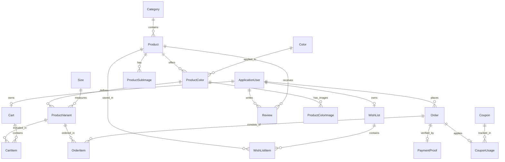

# NASIJ-PORTFOLIO

### Clothing E-Commerce Website

---

## 📌 Project Overview

**TMAProject** is a full-featured, commercial e-commerce platform built for **KIRAH Maison**, a real luxury clothing and fashion brand. The project was engineered to manage end-to-end commercial e-commerce operations, including complex product variant configurations (color-specific images, size inventory, stock tracking), customer shopping experience, promotional coupon engines, manual payment verification (InstaPay & Vodafone Cash), automated email notifications, and an admin management dashboard.

The application was developed for a real client and is currently deployed and active in a real-world business environment.

---

## 🚀 Key Features

### 🛍️ Customer Features
* **Interactive Storefront**: Featured collection hero banners, promotional showcases, and curated category line browsing.
* **Advanced Product Search & Filtering**: Multi-criteria search by keyword, category, price range, and sorting options (Newest, Price Low to High, Price High to Low, Most Discounted).
* **Color & Size Variant Selection**: Interactive product details page with color-specific image galleries, real-time size availability badges, and stock level warnings.
* **Shopping Cart System**: Real-time quantity adjustment, coupon application, price breakdown, and smooth removal confirmation prompts.
* **Wishlist Management**: Quick-toggle wishlist icons on product cards and a dedicated wishlist overview page.
* **Checkout & Order Placement**: Multi-step checkout form collecting recipient information, delivery address, notes, and payment method selection.
* **Manual Payment Proof Upload**: Direct receipt screenshot upload (for InstaPay / Vodafone Cash transfers) to Supabase Storage with sender phone number verification.
* **Order Tracking & History**: Real-time order status tracking (`Pending`, `Confirmed`, `Processed`, `Shipped`, `Delivered`, `Canceled`) and detailed itemized receipts.
* **Product Reviews & Ratings**: Verified patron reviews with 1 to 5 star ratings and written customer feedback.
* **User Profile Management**: Account details update, address book management, and secure password changes.

### 🛡️ Admin Features
* **Executive Dashboard**: Business KPIs including total revenue, active orders count, total products count, low stock inventory alerts, and recent order feeds.
* **Comprehensive Product Management**: Full control over products, mapping multiple colors, uploading color-specific images and sub-images, configuring size variants with specific stock quantities, and applying discounts.
* **Category, Color & Size Catalog Management**: Complete CRUD operations for categories, color hex codes/names, and clothing size definitions.
* **Order Fulfillment & Management**: Order review, detailed invoice views, status updates, and cancellation handling.
* **Payment Proof Verification**: Review system for InstaPay / Vodafone Cash payment screenshots with approve/reject workflows and custom rejection reasons.
* **Coupon & Promotion Engine**: Create percentage-based or fixed-amount discount coupons with minimum order totals, maximum discount caps, usage limits, and expiration dates.
* **User & Access Control**: User administration, account locking/unlocking, and role assignment (`Admin`, `Customer`).

---

## 🛠️ Technologies & Tools

### Backend
* **Language**: C# 13 / .NET 10
* **Framework**: ASP.NET Core 10.0 MVC
* **ORM**: Entity Framework Core 10.0 (`Npgsql.EntityFrameworkCore.PostgreSQL`)
* **Database**: PostgreSQL (Hosted on **Supabase**)
* **Authentication**: ASP.NET Core Identity with custom `ApplicationUser` and `IdentityRole`
* **Object Storage**: **Supabase Storage** (Integrated via REST API and `HttpClient`)
* **Image Processing**: `SixLabors.ImageSharp` 3.1 (Image resizing to 1200x1200 max, JPEG compression quality 75%)
* **Email Service**: `MailKit` 4.17 & `MimeKit` 4.17 (SMTP integration with StartTls)

### Frontend
* **Markup & Styling**: HTML5, CSS3 (Custom Luxury Dark Theme), Bootstrap 5
* **Interactivity**: Vanilla JavaScript (ES6+), jQuery 3.6
* **Icons & UI Modals**: FontAwesome 6, SweetAlert2 (Dark Glassmorphic Modals & Toasts)

### Tools & DevOps
* **IDE**: Microsoft Visual Studio / Visual Studio Code
* **Version Control**: Git / GitHub
* **Package Manager**: NuGet

---

## 🏗️ System Architecture

TMAProject follows a layered N-Tier architecture built on top of ASP.NET Core MVC, separating concerns between Data Access, Business Logic, View Models, and Presentation.

```
TMAProject Application Architecture
│
├── Presentation Layer (ASP.NET Core MVC Areas)
│   ├── Admin Area       --> Dashboard, Product/Order/Payment Management Controllers
│   ├── Customer Area    --> Storefront, Cart, Wishlist, Checkout, Order History Controllers
│   └── Identity Area    --> Authentication & Profile Management Controllers
│
├── Service / Business Logic Layer
│   ├── ProductService, CategoryService, ColorService, SizeService
│   ├── CartService, WishlistService, OrderService, CouponService
│   ├── PaymentService, ReviewService, ImageService, EmailSender
│
├── Data Access / Repository Layer
│   ├── Repositories (ProductRepository, OrderRepository, CartRepository, etc.)
│   ├── ApplicationDbContext (EF Core)
│   └── Fluent API Entity Configurations
│
└── Infrastructure & Third-Party Integrations
    ├── Supabase PostgreSQL (Relational Database)
    ├── Supabase Storage (CDN Image Upload & Management)
    └── SMTP Email Gateway (MailKit & MimeKit)
```

### Architecture Highlights
* **Repository Pattern**: Encapsulates data persistence operations, abstracting EF Core queries behind clean interfaces (`IProductRepository`, `IOrderRepository`, etc.).
* **Service Layer Pattern**: Contains business rules, validation logic, stock checks, discount calculations, and orchestration between repositories and third-party APIs.
* **ASP.NET Core Areas**: Logically segregates `Admin`, `Customer`, and `Identity` modules into modular directory structures.
* **DB Initializer**: Automated database migration execution on startup and automatic seed logic for default roles (`Admin`, `Customer`) and administrator accounts.

---

## 🔐 Authentication & Authorization

Authentication and authorization are powered by **ASP.NET Core Identity** configured with custom cookie authentication and Role-Based Access Control (RBAC).

* **Roles**:
  * `Admin`: Full access to the `/Admin` Area, dashboard analytics, catalog setup, payment review, and user controls.
  * `Customer`: Access to checkout, wishlist, order history, reviews, and profile management.
* **Security Controls**:
  * Form Anti-Forgery Tokens (`[ValidateAntiForgeryToken]`) on state-modifying endpoints.
  * Endpoint Protection via `[Authorize]`, `[Authorize(Roles = "Admin")]`, and `[Area("Admin")]` attributes.
  * Automatic input sanitization (e.g., automated whitespace stripping on username registration).
  * Cookie redirection configuration for unauthorized access (`/Identity/Account/Login` and `/Identity/Account/AccessDenied`).

---

## 👔 Product Management & Variants System

The product architecture supports complex fashion merchandise requirements:

```
[Category] ── (1:N) ──> [Product] ── (1:N) ──> [ProductColor] ── (1:N) ──> [ProductColorImage]
                                                    │
                                                  (1:N)
                                                    │
                                                    ▼
                                            [ProductVariant] <── (N:1) ── [Size]
```

* **Product**: Stores global metadata (Name, Description, Base Price, Main Image URL, Discount Percentage, Average Rating).
* **ProductColor**: Maps a product to a specific color definition (Color Name & Hex Code).
* **ProductColorImage**: Stores color-specific high-resolution image URLs uploaded to Supabase Storage.
* **ProductVariant**: Combines a `ProductColor` with a `Size` (S, M, L, XL, XXL) and tracks the exact inventory `Quantity`.
* **Stock Protection**: `ProductVariant` items are linked to cart and order items, enforcing stock checks prior to cart addition and checkout completion.

---

## 🛒 Shopping Experience & Checkout

1. **Browsing & Discovery**: Customers browse curated collections or search/filter by category, price, and discounts.
2. **Variant Selection**: On the product page, selecting a color dynamically switches the main gallery to images corresponding to that color and filters available size options.
3. **Cart Management**: Items added to cart reference the exact `ProductVariantId`. Quantities are updated in real-time. Reducing quantity to 0 triggers a smooth SweetAlert2 removal prompt.
4. **Coupon Application**: Applying a valid coupon code verifies minimum order thresholds, expiration dates, and usage caps, adjusting the order subtotal.
5. **Checkout Options**:
   * **Cash on Delivery (`OnCashDelivery`)**: Order is placed immediately with `Pending` payment status.
   * **InstaPay / Vodafone Cash (`Instapay`, `VodafoneCash`)**: Order is created with payment instructions. Customer uploads payment receipt screenshot (`PaymentProof`), which is sent for Admin review.

---

## 📦 Order & Payment Management

### Order Lifecycle
```
[Pending] ──> [Confirmed] ──> [Processed] ──> [Shipped] ──> [Delivered]
    │
    └───> [Canceled]
```

* **Order Statuses**: `Pending`, `Confirmed`, `Processed`, `Shipped`, `Delivered`, `Canceled`.
* **Payment Statuses**: `Pending`, `Paid`, `Failed`.
* **Payment Proof Workflow**:
  1. Customer uploads receipt image after selecting InstaPay or Vodafone Cash.
  2. `PaymentProof` entity records the image URL (Supabase Storage), sender phone number, notes, and timestamp with `Pending` status.
  3. Administrator inspects the receipt in the Admin Panel and clicks **Approve** (marks payment `Paid` and order `Confirmed`) or **Reject** (provides rejection reason).

---

## 🗄️ Database & Supabase Integration

### 1. Supabase PostgreSQL Database
The primary relational database is hosted on **Supabase PostgreSQL**. Entity Framework Core connects to PostgreSQL via `Npgsql.EntityFrameworkCore.PostgreSQL`.

* Timestamps use UTC (`DateTime.UtcNow`).
* Configurations use EF Core Fluent API (`IEntityTypeConfiguration<T>`) to define key constraints, relationships, decimal precision, and indexes.

### 2. Supabase Storage
Media assets (product main images, color images, sub-images, category photos, and payment receipt proofs) are stored in a dedicated **Supabase Storage Bucket**.

* `ImageService` processes images in memory using `SixLabors.ImageSharp` (resizing large files to a max 1200x1200px bounding box and compressing to 75% quality JPEG).
* Compressed image streams are uploaded directly to Supabase Storage via `HttpClient` REST calls (`/storage/v1/object/{bucket}/{path}`).
* Deletion calls remove objects directly from the storage bucket when products or images are removed.

---

## 📧 Email Functionality

Automated transaction emails are handled by `EmailSender` implementing ASP.NET Core `IEmailSender` using **MailKit** and **MimeKit**.

* **Protocols**: SMTP with `StartTls` encryption.
* **Use Cases**: Account registration confirmation, email verification links, password resets, and order updates.

---

## 📊 Admin Dashboard

The Admin Panel (`/Admin/Dashboard`) provides administrators with operational visibility:

* **Key Performance Indicators (KPIs)**: Total revenue generated, total active orders count, total catalog products, low stock inventory items (< 5 remaining).
* **Catalog Management**: Unified interfaces to create products with multi-color galleries and size matrixes.
* **Payment Audit**: Dedicated proof review dashboard showing sender phone numbers and uploaded transaction images.

---

## 📂 Project Structure

```text
TMAProject
├── AppConfiguration.cs              # Dependency Injection & Identity configuration extension
├── Program.cs                       # Web application entry point & middleware pipeline
├── TMAProject.csproj                # Project dependencies & framework settings
├── appsettings.json                 # Core configuration settings & connection strings
│
├── Areas
│   ├── Admin                        # Administrator Area
│   │   ├── Controllers              # Dashboard, Product, Category, Order, Payment, Coupon, User Controllers
│   │   └── Views                    # Admin UI Razer Views & Layouts
│   ├── Customer                     # Storefront Area
│   │   ├── Controllers              # Home, Product, Cart, Wishlist, Order, Payment, Review Controllers
│   │   └── Views                    # Customer UI Razor Views & Layouts
│   └── Identity                     # Authentication Area
│       ├── Controllers              # Account & Profile Controllers
│       └── Views                    # Login, Register, Profile Views
│
├── Common / Comomn
│   ├── DBInitilizer                 # Database migration & seed initializer
│   └── Settings                     # Strongly-typed settings (EmailSettings, SupabaseSettings, PaymentSettings)
│
├── DataAccess
│   ├── ApplicationDbContext.cs      # EF Core DbContext definition
│   └── Configurations               # Fluent API Entity Configurations (Product, Order, Cart, etc.)
│
├── Models
│   ├── Entities                     # Domain Entities (Product, ProductVariant, Order, Cart, User, etc.)
│   └── Enums                        # Domain Enums (OrderStatus, PaymentMethod, PaymentProofStatus, etc.)
│
├── Repositories
│   ├── Implementations              # Data access repositories (ProductRepository, OrderRepository, etc.)
│   └── Interfaces                   # Repository interface abstractions
│
├── Services
│   ├── Implementations              # Business logic services (ProductService, OrderService, ImageService, EmailSender, etc.)
│   └── Interfaces                   # Service interface abstractions
│
├── ViewModels                       # Strongly-typed Data Transfer Objects for Razor Views
│   ├── Admin                        # ProductCreateVM, ProductEditVM, OrderDetailsVM, etc.
│   └── Customer                     # ProductDetailsVM, HomeVM, CartVM, CheckoutVM, etc.
│
└── wwwroot                          # Static assets
    ├── css                          # Customer luxury stylesheet & Admin styles
    ├── js                           # Site-wide SweetAlert2 modals, toasts & double-submit protection
    └── lib                          # Vendor libraries (Bootstrap, jQuery, FontAwesome)
```

---

## 🔀 Database Relationships (ER Diagram)




## 🌐 Live Project

The application is currently deployed and actively used by a real fashion client.

🔗 **Visit the Live Website:** [KIRAH Maison](https://kirah.runasp.net/)

---

## 🔒 Security & Configuration

To run this application securely, sensitive credentials must be configured in `appsettings.json` or Environment Variables. **Never commit private credentials to public repositories.**

### Required Configuration Sections
```json
{
  "ConnectionStrings": {
    "DefaultConnection": "Host=YOUR_SUPABASE_HOST;Database=YOUR_DB;Username=YOUR_USER;Password=YOUR_PASSWORD;Port=5432;"
  },
  "Supabase": {
    "Url": "https://YOUR_SUPABASE_PROJECT.supabase.co",
    "Key": "YOUR_SUPABASE_ANON_OR_SERVICE_KEY",
    "Bucket": "YOUR_STORAGE_BUCKET_NAME"
  },
  "EmailSettings": {
    "Host": "smtp.your-email-provider.com",
    "Port": 587,
    "Email": "your-email@domain.com",
    "Password": "YOUR_SMTP_PASSWORD",
    "DisplayName": "KIRAH Maison"
  }
}
```

---

## ⚙️ Installation & Setup

### Prerequisites
* [.NET 10.0 SDK](https://dotnet.microsoft.com/download/dotnet/10.0)
* PostgreSQL Database (or [Supabase Account](https://supabase.com))
* Git

### Steps

1. **Clone the Repository**:
   ```bash
   git clone https://github.com/YOUR_GITHUB_USERNAME/TMAProject.git
   cd TMAProject/TMAProject
   ```

2. **Configure Application Settings**:
   Update `appsettings.json` with your PostgreSQL database connection string, Supabase Storage credentials, and Email SMTP settings.

3. **Apply Database Migrations**:
   Run Entity Framework Core migrations to create tables and database constraints:
   ```bash
   dotnet ef database update
   ```

4. **Run the Application**:
   ```bash
   dotnet run
   ```
   Open your browser and navigate to `https://localhost:5001` or `http://localhost:5000`.

---

## 🔮 Future Improvements

* **Online Payment Gateway**: Integrate automated credit card payment gateways (e.g., Paymob, Stripe) alongside manual InstaPay/Vodafone Cash proofs.
* **Real-time Order Notifications**: Add WebSockets / SignalR for instant admin notifications when new orders or payment proofs arrive.
* **Enhanced Analytics**: Export sales reports to Excel/PDF for accounting.

---
🔒 Source Code
The source code is maintained in a private repository due to client confidentiality.
---

## 👨‍💻 Developer

**Mohamed Hamada**  
*Backend Developer — C# / ASP.NET Core*

This project was custom engineered and delivered for a real commercial client to support active e-commerce operations.
